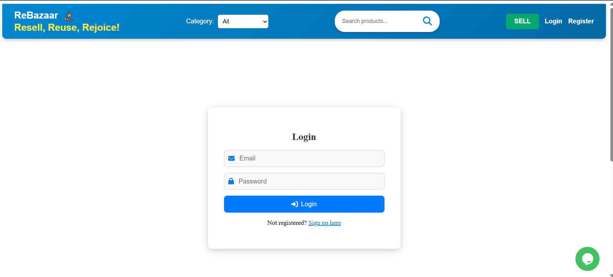
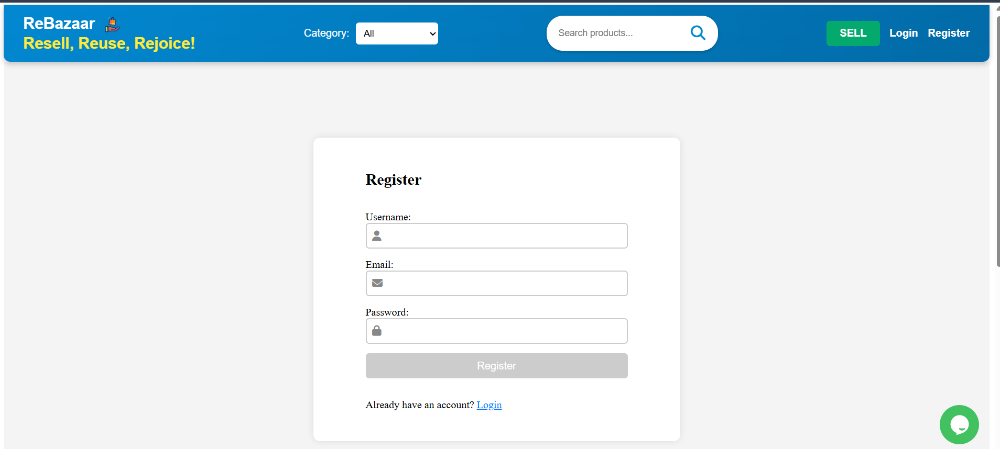
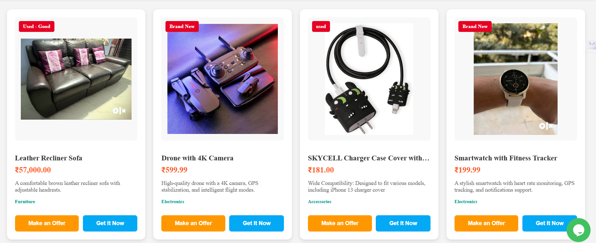
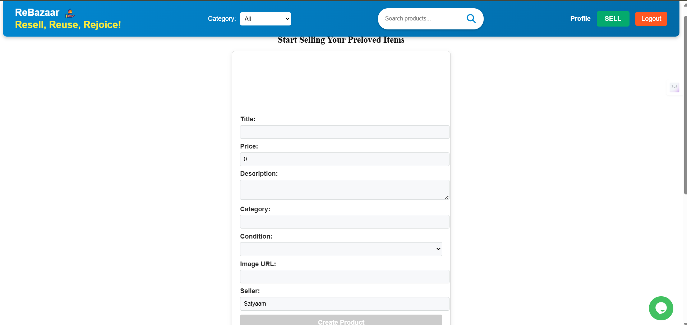

# ♻️ ReBazaar – Resell, Reuse, Rejoice! 🛍️

## 🌟 Description

Welcome to **ReBazaar** – a web application for buying and selling secondhand items! 🔄🏷️💰 This platform allows users to:

✅ Register & Log in 🔐 
✅ Create & Manage Product Listings 📦  
✅ Browse Available Products 🛒

🌱 **Resell, Reuse, Rejoice!** 🌎

---

## 📁 Folder Structure 📂

```
backend/
├── config/               # ⚙️ Configuration files 🛠️
│   ├── db.js             # 🛢️ Database connection
├── middleware/           # 🔒 Middleware for authentication & error handling
│   ├── auth.js           # 🛡️ Protect routes
├── models/               # 🗂️ Mongoose models
│   ├── User.js           # 👤 User model schema
│   ├── Product.js        # 📦 Product model schema
├── routes/               # 🛣️ API routes
│   ├── authRoutes.js     # 🔐 Authentication routes
│   ├── productRoutes.js  # 🏷️ Product-related routes
├── .env                  # 🌍 Environment variables
├── package.json          # 📦 Backend dependencies
├── server.js             # 🚀 Main server file (Entry point)


frontend/
├── src/                  # 🎨 Source files for Angular application
│   ├── app/              # 🏗️ Main application components
│   ├── components/       # 🧩 Reusable components
│   ├── services/         # 🔄 Services for API calls
│   ├── styles.css        # 🎨 Global styles
│   └── index.html        # 📜 Main HTML file
├── package.json          # 📦 Frontend dependencies
└── angular.json          # ⚙️ Angular configuration
```

---

## 🚀 Installation Instructions

### ✅ Prerequisites
- 🟢 **Node.js** (version 14 or higher)
- 🍃 **MongoDB** (installed and running)

### 📥 Clone the repository
```bash
git clone https://github.com/Satyaamp/ReBazaar.git
cd rebazaar
```

### 📌 Backend Setup
1️⃣ Navigate to the backend directory and install dependencies:
```bash
cd backend
npm install
```

2️⃣ Create a `.env` file in the backend directory with the following content:
```ini
MONGO_URI=your_mongodb_uri
JWT_SECRET=your_jwt_secret
PORT=3000
```

### 🎨 Frontend Setup
1️⃣ Navigate to the frontend directory and install dependencies:
```bash
cd ../frontend
npm install
```

---

## 🎯 Usage

### Start the backend server

You can start the backend server using one of the following commands:

For production:
```bash
cd backend
node server.js
```

For development (auto-restart on changes):
```bash
cd backend
nodemon server.js
```

### 🚀 Start the frontend application
```bash
cd frontend
ng serve
```

### 🌐 Open your browser and navigate to:
`http://localhost:4200`

---

## 🔍 API Endpoints

### 🔑 Authentication
- `POST /api/auth/login` ➡️ Log in a user 🔐
- `POST /api/auth/register` ➡️ Register a new user 📝

### 📦 Products
- `GET /api/products` ➡️ Get a list of products 📜
- `GET /api/products/:id` ➡️ Get details of a specific product 🔍
- `POST /api/products` ➡️ Create a new product ➕

---

## 🧪 Testing Instructions

📌 To run tests, navigate to the backend or frontend directory and use the following commands:

- **Backend Tests**
```bash
cd backend
npm test
```

- **Frontend Tests**
```bash
cd frontend
ng test
```

---

## 📸 Screenshots

Here are some screenshots of **ReBazaar**:

### 🏠 Homepage


### 🔐 Login Page


### 📝 Register Page


### 🛒 Product Listings


### ➕ Create Listing


---

## ⚠️ Known Issues

❌ Currently, the application **does not support image uploads** for product listings.  
❌ Some API endpoints **may require additional validation and error handling**.

---

## 🤝 Contributing

💡 Contributions are **welcome**! Feel free to submit a pull request or open an issue for suggestions and improvements. 🚀

---

## 📜 License

📄 This project is licensed under the **MIT License**. Feel free to use and modify it! 🎉

---

🚀 **ReSell, ReUse, ReJoice!** ♻️🛒